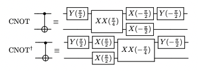

# Hidden Inverse Circuits for Coherent Error Supression 

**Key reference:** https://arxiv.org/abs/2104.01119

**Idea:** Self adjoint gates such as CX have two equivalent decompositons into hardware native gates. Find symmetric circuits and use both decompostions to cancel coherent errors.

Contributions and suggestions for future work welcome.

If we have a matrix $M$ satisfying $M=M^\dagger$ we say that $M$ is self adjoint.
We can decompose this matrix $M$ in two ways. 

$$
\begin{equation}
M = ABC = C^\dagger  B^\dagger  A^\dagger = M^\dagger
\end{equation}
$$

Here $M$ represents the unitary (and self-adjoint) matrix associated with a two qubit gate.

## What does this repo contain? Hidden inverse passes targeting the H-Series gateset

1. A method to quickly get the hidden inverse circuits for an two qubit gate with a hidden inverse. The H-Series gateset is used -> [here](https://github.com/CQCL/hidden_inverse_exp/blob/main/hseries_decompositions.py).
2. An "alernating CNOT decompostion" pass -> [here](https://github.com/CQCL/hidden_inverse_exp/blob/main/alternating_cnot_decomposition.py) that compiles every CNOT to the H-Series gateset and uses the hidden inverse decomposition if a CNOT uses the same two qubits as a previous CNOT. 
3. A compilation pass to compile Pauli gadget circuits using the LHS and RHS decomposition of CNOT gates -> [here](https://github.com/CQCL/hidden_inverse_exp/blob/main/pauli_gadget_pass.py)
4. A phase gadget pass (probably legacy) -> [here](https://github.com/CQCL/hidden_inverse_exp/blob/main/phase_gadget_pass.py) should be covered by (2.)
5. A demo notebook -> [here](https://github.com/CQCL/hidden_inverse_exp/blob/main/demo_notebook.ipynb)
6. Various utilities -> [here](https://github.com/CQCL/hidden_inverse_exp/tree/main/utils)
7. Tests (need more!) -> [here](https://github.com/CQCL/hidden_inverse_exp/blob/main/tests.py)

## Ideas and Future Directions

1. Run some phase/pauli gadgets on H-series emulator/real device. Find out if coherent errors are suppressed
2. Test out this method for QEC gadgets (Maybe on real hardware? Talk more to Ben and Natalie).
3. Test this out with classical `ToffoliBox` circuits?
4. Figure out how this might play nicely with `OptimisePhaseGadgets` and `PauliSimp`.
5. Benchmark performance of alternating CNOT decomposition post `FullPeepholeOptimise`
6. Clean up and generalise code. Integrate into TKET somehow?